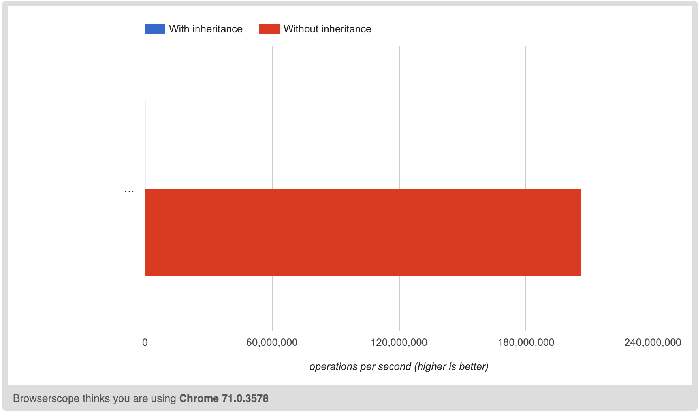

# Inheritance is free.

JS is a dynamic language - but sometimes too dynamic. It's implementation of "object orientation" uses a design called prototypal inheritance which consists of all objects having a prototype which is the "class" implementation that is passed down into it. When you request properties from the object, the runtime first checks the object and then checks its prototype until it is able to find a value - therefore, attempts to access an immediate property would be faster than trying to access a property from the prototype. When using inheritance, you pay the cost of traversal for each layer of the inheritance.

Furthermore, prototypes are just simple objects and therefore also dynamic. This leads to some pains in performance such as having to lookup any properties/methods against the actual object, then against its prototype, and then against the prototype of the prototype, etc. This cost tends to add up and actually slows down the application quite a bit.

Modern day JITs inside of JS engines come with optimizations to help ease this pain. For instance, V8 will attempt to analyze the shape of your object and if it is has a stable shape (i.e. a static one), then it will produce a C++ class for your object and use that to manage your object - which can help speed up property lookups.

But the cost is there all the same - and if we rely on the JIT for this sort of optimization, then we've already taken a performance hit. Hopefully optimization compilers will be able to assist with this one day! In this case, it is important to note that that object oriented programming is a design pattern for humans, not for machines.

For instance, we could take a source file like this:

```javascript
class Hero {
  constructor(name) {
    this.name = name
  }
}

let _
class Batman extends Hero {
  sayHello() {
    _ = `I'm ${this.name}!`
  }
}

var batman = new Batman()
batman.sayHello()
```

Which could be compiled to remove the object oriented bits:

```javascript
function Batman(name) {
  return { name }
}

let _
function Batman$sayHello($this) {
  _ = $this.name
}

var batman = Batman()
Batman$sayHello(batman)
```

This way the object-oriented bits such as access modifiers and such can be protected at compile-time but all of those bits don't need to be enforced at runtime. Just as a sample, I created a little benchmark out of this:

Sample benchmark: [https://jsperf.com/inheritance-is-free](https://jsperf.com/inheritance-is-free)



```
120,144 op/s - with inheritance
207,057,685 op/s - without inheritance
```

*Run on a MacBook Pro (Mid-2014) via Chrome 71.0.3578.98.*

