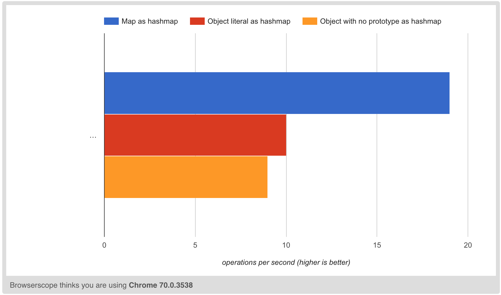

# Objects are hashmaps.

In JS, it is very common to assume that since objects work as dictionaries, we should use them as hashmaps in our algorithms. However, objects are still built for a more complex use case.

In particular, object literals have a parent prototype and therefore property lookups happen against the prototype chain instead of just the immediate object. This can be optimized significantly by opting to use objects with a `null` prototype, since the lookups will be simplified.

However, since ES2015 Maps were targetted at providing a dedicated hashmap implementation, they are far more optimized for this use case.

In one particular production use case, the Jest team was able to reduce their time by 20% by switching from `null` prototype objects to ES2015 Maps ([Source](https://twitter.com/v8js/status/1040219491358179328)).

Sample benchmark: [https://jsperf.com/objects-are-hashmaps](https://jsperf.com/objects-are-hashmaps)

*Run on a MacBook Pro (Mid-2014) via Chrome 70.0.3538.110.*
